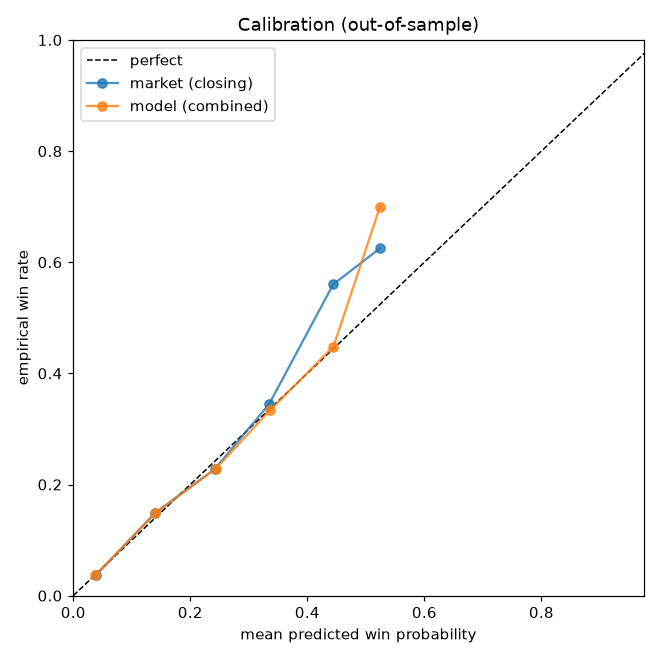
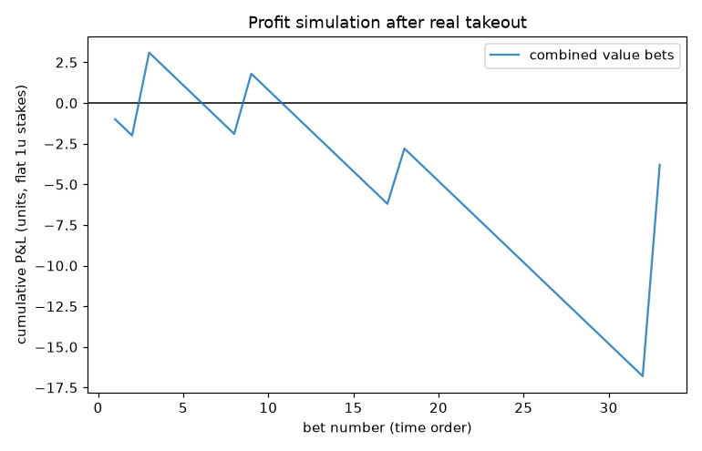

# 🐎 HKJC Edge Lab

**An honest, end-to-end research tool that asks: can a public-data model beat the Hong Kong Jockey Club betting market? It rigorously determines the answer — and the answer is no.**

<p>


</p>

HKJC Edge Lab ingests Hong Kong horse-racing data, models win probabilities, validates
itself with strict walk-forward out-of-sample testing, and ships a polished local desktop app
to explore the results. It is built to **detect the *absence* of an edge as readily as its
presence** — and on a full 2025/26 season it concludes, with bootstrap confidence intervals,
that there is **no demonstrated edge over the closing line**. That honest "NO-GO / NO BET" is
the product working, not failing.

> ### ⚠️ Disclaimer — read first
> This is a **personal research / decision-support tool**, **not** betting or financial
> advice, and **not affiliated with or endorsed by the HKJC**. Its validated verdict is
> **NO-GO**: no edge over the market; you are expected to lose the **~17.5% takeout** on
> average. Betting with an unauthorised (offshore/illegal) operator is an offence under the
> **Hong Kong Gambling Ordinance (Cap. 148)**. Any data collected from HKJC pages is subject
> to that site's **Terms of Service & robots.txt** — personal use only, do not redistribute.
> Simulated/backtest results are hypothetical and after-takeout. **Use at your own risk.** If
> gambling affects you: Ping Wo Fund **183 4633**.

---

## The result, up front

On a near-complete **2025/26 HKJC season (765 races; 356 out-of-sample test races, walk-forward)**:

| Test | Result | Reading |
|---|---|---|
| **Closing-line value** (model vs market, OOS winner log-loss) | margin **+0.0045 nats/race**, 95% CI **[−0.0013, +0.0107]** | **Not significant** — does *not* beat the close |
| **+EV bets after takeout** | **0** | the model never disagrees with the market by more than the 17.5% takeout |
| **Bet-all baseline ROI** | **≈ −takeout** | confirms the algebraic certainty that you can't dutch your way out |
| **Two-stage combiner weights** | market **×1.17** vs model **×0.02** | the model's best move is to *trust the crowd* |
| **Placebo (market-consistent null)** | margin ≈ 0 | the pipeline invents no spurious edge |
| **Verdict** | **NO-GO** | default action everywhere is **NO BET** |

This reproduces, on real data, both Bill Benter's central finding (the public odds are most of
the signal) and the academic result that the HKJC market is among the most efficient on earth.

**Reproduce it yourself** — a historical paper-trading backtest walks forward through the
season, bets at the actual closing odds (model trained only on prior races), and tallies the
realized P&L after takeout:

```bash
python scripts/historical_backtest.py
```

Honest result: the model's "top pick", the market favourite, and betting every runner all
return a **significantly negative** ROI (≈ −takeout); the only non-negative numbers come from a
handful of bets concentrated in **4 races** where the model wildly disagreed with the market —
correctly flagged as *too few races* to mean anything. (Verified by a 2-auditor adversarial
review for lookahead and statistical honesty.)

<p align="center">


</p>
<p align="center"><em>Left: out-of-sample calibration — the model (indigo) tracks the market (grey) almost exactly. Right: simulated cumulative P&L after the real takeout — there is no edge to extract.</em></p>

---

## HKJC Edge Lab — the desktop app

A native macOS window (Flask backend + a vanilla-JS dashboard via pywebview): a calm "quant
terminal," not a casino. Honest by construction — NO-BET default on every screen, the GO/NO-GO
verdict and bootstrap CIs shown wherever any EV appears, and the edge gate **off** by default.

```
┌────────────┬──────────────────────────────────────────────────────────────────┐
│ HKJC EDGE  │  Race Recommender                            [ Sha Tin · 13 Jun ▾ ]│
│ ░ LAB      │  ⚠ NO BET — model does not beat the closing line (NO-GO).          │
│ ◆ Overview │  Race 5 · 1200m · Class 3 · 12 runners                             │
│ ★ Recommend│  ┌────┬────────┬────────┬────────┬───────┬──────────┐              │
│ RESEARCH   │  │ #  │ Model% │ Mkt%   │ Edge   │  EV   │ Verdict  │              │
│ ◇ Validate │  │ 5  │ 20.4   │ 20.0   │ +0.02  │ −16%  │ ⬤ NO BET │              │
│ ◇ Model Lab│  │ 2  │ 13.2   │ 13.2   │ −0.00  │ −18%  │ ⬤ NO BET │              │
│ ◇ Backtest │  │ …  │ …      │ …      │ …      │ …     │          │              │
│ DATA       │  └────┴────────┴────────┴────────┴───────┴──────────┘              │
│ ◇ Tracking │  Why NO BET: combiner weights market ×1.17 · model ×0.02;          │
│ ● NO-GO    │  after 17.5% takeout, 0 of 12 runners clear the EV gate.           │
└────────────┴──────────────────────────────────────────────────────────────────┘
```

**Pages:** Overview · ★ Race Recommender (model vs market + EV) · Validation (CLV + CI + plots)
· Model Lab (feature importance + combiner weights + calibration) · Backtest & What-if
(interactive EV-threshold sweep over the frozen OOS backtest) · Data & Coverage · Tracking
(self-graded closing-line value & P&L) · Feasibility report · Settings.

### Launch it

```bash
git clone https://github.com/justinsuo/hkjc-edge-lab.git && cd hkjc-edge-lab
python3 -m venv .venv && source .venv/bin/activate
pip install -e ".[app]"                 # flask + pywebview + sklearn/scipy + plotting
python scripts/make_macos_app.py        # creates "HKJC Edge Lab.app" in ~/Applications
open "$HOME/Applications/HKJC Edge Lab.app"
# or run directly:
hkjc-app                                 # native window
hkjc-app --browser                       # open in the default browser
```

> The repo ships **without** any HKJC data (ToS: no redistribution). On first run the app
> shows empty/NO-GO states until you build a dataset — either import a CSV (e.g. the Kaggle
> `gdaley/hkracing` set) or politely fetch meetings yourself (see below).

---

## How it works — the pipeline (Phases 0–4)

The project was built as five honest phases. Each gates the next.

| Phase | What | Outcome |
|---|---|---|
| **0 · Research** | Market-efficiency review + Benter syndicate history + takeout rates + arbitrage feasibility + data sources & legality | [`research_report.md`](research_report.md) — *unlikely to beat the market; treat as research* |
| **1 · Data** | Modular, polite, provenance-logged collector → documented SQLite; a **no-lookahead** dataset builder | reproducible, leak-free backtest data |
| **2 · Modelling** | Conditional-logit (Plackett-Luce) + gradient boosting; **Benter two-stage** market combination; Harville/Monte-Carlo exotics; calibration | model reproduces the market; adds ~nothing |
| **3 · Validation** | Walk-forward OOS, **closing-line value** w/ bootstrap CI, profit sim after real takeout, placebo, overfitting checks | **NO-GO** |
| **4 · Runtime app** | NO-BET-by-default recommender + EV/Kelly + honest cross-pool *signal* (not arbitrage) + self-tracking | shows the truth; recommends nothing |

### Key methodology

- **No lookahead, enforced by tests.** Every feature uses only information available at bet
  time: race conditions, declared runner fields, form aggregated from *strictly prior* races
  (including a leak-free speed rating built against a prior-only "par"), and the de-vigged
  market probability. Outcomes are labels only. A test asserts that appending a *future* race
  never changes a past row's features.
- **Closing-line value is the primary test.** In a pari-mutuel pool the close *is* the settle
  price, so "beating the closing line" = being better calibrated than the market. Measured
  out-of-sample with a bootstrap CI on the margin. No significant improvement ⇒ no edge.
- **Benter two-stage combination.** A fundamental conditional-logit model is blended with the
  market via a 2-parameter combiner (`log(model_prob)`, `log(market_prob)`). The combiner
  honestly learns to weight the market ~1.17 and the model ~0.02.
- **EV after *real* takeout.** Pari-mutuel odds already embed the takeout, so `EV = p·O − 1`.
  Betting at the market's own probabilities returns exactly −takeout — the wall you must clear.
- **Adversarial by design.** Placebo (market-consistent null), bet-all/bet-favourite
  baselines, train-vs-OOS gap, and CIs everywhere guard against fooling ourselves.

---

## Quickstart (CLI)

```bash
pip install -e .                                    # core pipeline (no app deps)
hkjc init-db                                        # create data/hkjc.sqlite
hkjc import-csv --races races.csv --runs runs.csv   # bulk import (Kaggle gdaley/hkracing format)
#   …or politely fetch from HKJC yourself (rate-limited, cached, robots-respecting):
hkjc fetch-range --start 2025-09-01 --end 2026-06-30 --courses ST,HV
hkjc build-dataset                                  # no-lookahead backtest table
hkjc train                                          # Phase 2: model vs market (OOS)
hkjc validate                                       # Phase 3: walk-forward, CLV, GO/NO-GO
hkjc recommend --date 2026-06-13 --course ST --race 5   # Phase 4: model vs market + EV (NO BET)
hkjc track                                          # reconcile recs → own CLV & P&L
hkjc status
```

---

## Honesty & guardrails (baked in)

- **NO BET is the default and the most common output.** The tool is a skeptic, not a
  confidence machine. The edge gate is **OFF** (turning it on requires a blocking modal +
  explicit confirmation, raises a persistent banner, and resets on relaunch).
- **The verdict and its uncertainty travel together.** Every CLV/ROI/edge figure shows its
  bootstrap CI; "not significant" styling is impossible to miss.
- **"Arbitrage" is never claimed.** Intra-pool dutching is a *provable* −takeout loss; the
  cross-pool feature is an honest **consistency signal**, explicitly labelled *not arbitrage*.
- **Bankroll guardrails are loss limits, not profit tools:** fractional (¼) Kelly with hard
  per-bet / per-race / total-exposure caps, plus session-loss and stop-loss limits that refuse
  to size beyond configured bounds. (Only relevant if a validated edge is ever established.)
- **The tool grades itself.** Every recommendation is logged with the odds at the time, then
  reconciled against results to track the tool's own closing-line value and P&L over time.

---

## Data sources, ToS & legality

- **Primary source:** public HKJC results pages (server-rendered) — race conditions, finishing
  positions, draw, weights, jockey/trainer, sectional times, **closing Win odds (the SP)**, and
  all pool dividends. The collector respects `robots.txt`, rate-limits (≥4 s/host with jitter),
  caches aggressively, logs provenance, and enforces a hard per-run request cap.
- **No historical odds archive** is published by HKJC; the SP from results is the close.
- **Legality/ToS:** factual results aren't copyrightable, but HKJC's compiled pages and member
  terms restrict reproduction/redistribution. This project is **personal/research scale only**
  and **never redistributes raw HKJC data** (`data/` is git-ignored and not in this repo).
  Betting with non-HKJC operators in Hong Kong is illegal (Cap. 148).

---

## Project structure

```
hkjc-edge-lab/
├── research_report.md         # Phase 0 — market-efficiency & feasibility (READ FIRST)
├── config/                    # config.yaml + .env.example
├── hkjc_edge/
│   ├── cli.py  config.py
│   ├── db/                    # schema.sql + database.py (provenance helpers)
│   ├── sources/               # polite http client, HKJC scrapers, CSV import, parsers
│   ├── pipeline/              # ingest (source→DB), dataset (no-lookahead builder)
│   ├── model/                 # conditional-logit, GBM, harville, market de-vig, calibration, evaluate
│   ├── validation/            # walk-forward, metrics (CLV/profit), whatif, plots, run (verdict)
│   ├── app/                   # EV/Kelly/guardrails, consistency signal, recommender, tracking
│   └── web/                   # service (caching), Flask server, jobs, launcher, static/ (the SPA)
├── tests/                     # 65 tests — parsers, no-lookahead, probability math, web layer
├── scripts/make_macos_app.py  # builds the .app bundle
└── docs/img/                  # result figures
```

## Tests

```bash
pip install -e ".[dev]"
pytest -q          # 65 tests: parsers, schema/provenance, polite HTTP client, the
                   # no-lookahead guarantee, Harville/calibration/Kelly math, and the web layer
```

---

## Limitations & what would change the verdict

This is a public-data, no-rebate retail effort against one of the world's sharpest markets, so
the honest expectation — confirmed here — is **no edge**. The model *could* in principle become
profitable only with advantages this project does **not** have:

- **Rebates** on losing bets (10–12% on qualifying pools) available only to very-high-volume
  players — they roughly halve the effective takeout.
- **Proprietary data** the market underweights: GPS/biometric tracking, live in-running data,
  stable "work" intelligence — none of it public.
- **Late, automated betting** at near-final odds at scale.

Improvement attempts made here (leak-free speed ratings; Shin de-vig) improved the *standalone*
model but added **zero** edge over the market — the market already prices them in. The
appropriate framing is a **research / learning project**, not an income source.

## Acknowledgements

Builds on the published horse-racing modelling literature — Bolton & Chapman (1986), **Benter
(1994)**, Harville (1973), Ziemba & Hausch — and the market-efficiency studies of HKJC racing
(Busche & Hall 1988; Walls & Busche 1996). See [`research_report.md`](research_report.md) for
the full bibliography.

## License

[MIT](LICENSE) — with an additional research-only / not-betting-advice / not-HKJC-affiliated
notice. Read it before use.
